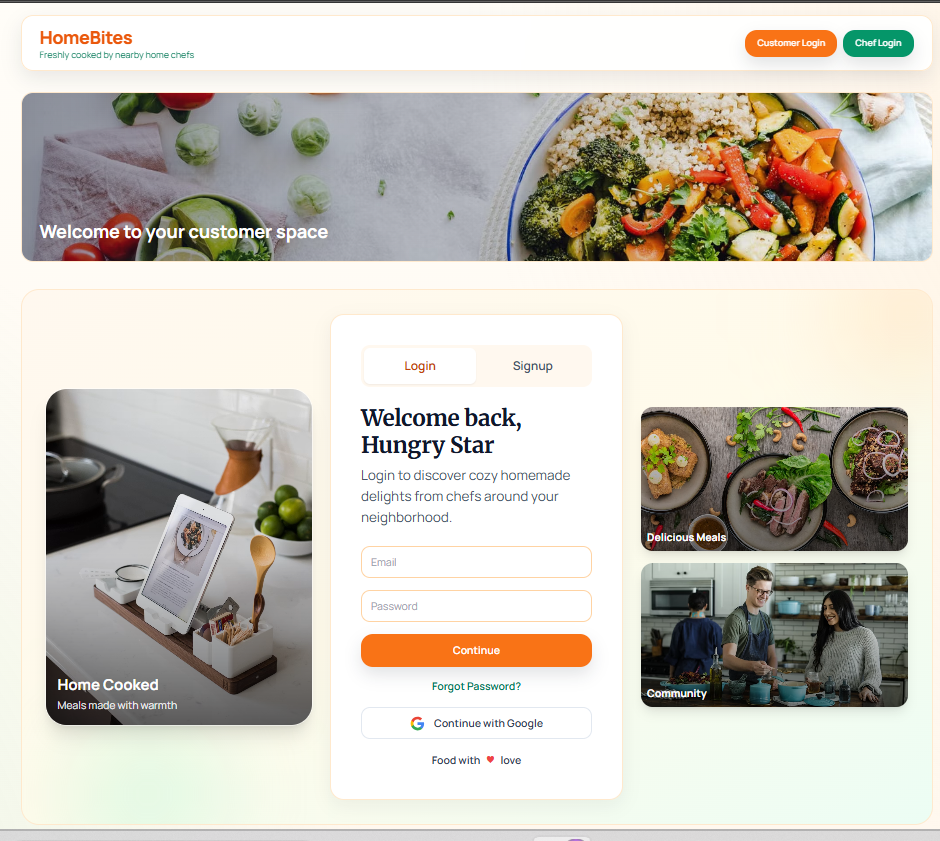

 

# 👋 Hi, I'm Pruthagwin Challuri

I'm a **Computer Science student** passionate about **Java, Backend Development, Cloud Computing, and Full Stack Development**.

I enjoy building practical software, solving real-world problems, and continuously improving my skills through projects and Data Structures & Algorithms.

> *"Engineering ideas into reliable software, one project at a time."*

---

# 💡 About Me

- 🎓 B.Tech CSE Student at **SR University**
- ☕ Java Backend Developer
- 🌐 MERN Stack Developer
- ☁️ AWS Cloud Enthusiast
- 🧠 Passionate about Data Structures & Algorithms
- 🚀 Currently building real-world projects

---

# 🚀 Currently Exploring

- Advanced Java
- Spring Boot
- MERN Stack
- AWS Cloud
- REST APIs
- System Design
- AI & LLM Applications

---

# 🎯 2026 Goals

- ✅ Solve 300+ LeetCode Problems
- ✅ Master Backend Development
- ✅ Build Production-ready MERN Projects
- ✅ Earn AWS Certifications
- ✅ Contribute to Open Source

---

# 🛠 Tech Stack

### 💻 Languages

### ⚙️ Frameworks

### 🗄 Databases

### ☁️ Cloud

### 🛠 Tools

---

# 🌟 Featured Projects

## 🍱 HomeBites

A full-stack platform connecting customers with home chefs to order fresh homemade food.

### Highlights

- Secure Authentication
- Role-Based Access
- MERN Stack
- REST APIs
- Responsive UI

**Tech Stack**

`React` `Node.js` `Express` `MongoDB` `Tailwind CSS`

🔗 **Repository**

https://github.com/pruthagwin123/HomeBites

---

## 📊 Feedback Polling

A real-time anonymous polling platform built for classrooms with live voting and instant analytics.

### Highlights

- Real-time Polling
- Socket.IO
- Live Analytics
- Anonymous Voting

**Tech Stack**

`React` `Node.js` `Express` `MongoDB` `Socket.IO`

🔗 **Repository**

https://github.com/pruthagwin123/feedbackpolling

---

# 🏆 Achievements

- 🥇 Secretary — Hackathon Club, SR University
- 💻 Participant — Anveshan 2025 Hackathon
- ☁️ Cloud Computing & Web Development Intern — Agratas Pvt. Ltd.
- 🧩 Active DSA & Competitive Programming Learner

---

# 📜 Certifications

| Certification | Issuer |
|---------------|--------|
| Building LLM Applications With Prompt Engineering | NVIDIA |
| AWS Cloud Foundations | AWS Academy |
| AWS Cloud Developing | AWS Academy |
| Software Engineering Job Simulation | JPMorgan Chase & Co. |
| Cloud Computing & Web Development Internship | Agratas Pvt. Ltd. |

---

# 📈 GitHub Analytics

---

# 💻 LeetCode

🔗 https://leetcode.com/u/Pruthagwin/

---

# 🤝 Connect With Me

---

# 🐍 Contribution Snake

---

### ⭐ Thanks for visiting my profile!

**Build • Learn • Improve • Repeat**

